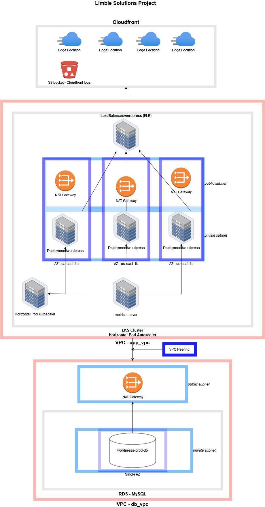

# Terraform AWS EKS

This is a proof-of-concept Wordpress deployment on AWS, utilizing Terraform, EKS, and MySQL on RDS.

## Table of Contents

1. [Goals](#Goals)
2. [Usage](#Usage)
3. [Challenges](#Challenges)
4. [Decisions](#Decisions)
5. [Future Ideas](#future-ideas)
6. [Diagram](#diagram)

## Goals

* Fully infrastructure-as-code
* Speed
* 16 hour time limit ([timelogged here](docs/timelog.md))

## Usage

Create a `configs/terraform/aws.tfvars` file:

```text
access_key = ""
secret_key = ""
db_password = ""
```

1. Terraform creation:

`cd configs/terraform; terraform {init,plan,apply} -var-file="aws.tfvars"`

2. Apply Kubernetes manifests:

`cd ../kubernetes; k apply -k ./`

3. Run Cloudfront creation (requires ELB endpoint to be known *after* kubectl apply): 

`cd ../terraform/cloudfront; terraform {init,plan,apply} -var-file="aws.tfvars`

## Challenges

The largest challenge I faced was becoming accustomed to Terraform and EKS. I tried both a community EKS module and the actual EKS AWS resource and greatly preferred the EKS module.

I spent a while troubleshooting a lack of connectivity on the pods after creation. They could pull down images just fine, but something was awry with their networking. The issue was that I needed to include the VPC CNI plugin to allow the pods to communicate on the VPC. That took a while to find.

There was a significant time sink destroying/creating some AWS resources, especially when I was repeatedly spinning up an EKS cluster to debug the VPC CNI problem. Testing iterations could take twenty minutes.

However once I overcame the initial hurdles of Terraform and EKS quirks, it was smooth sailing.

## Decisions

### EKS - Managed node vs self-managed vs Fargate

Managed node groups have no additional costs over self-managed nodes and automatically include ASGs. Fargate is better suited for temporary or burstable workloads rather than a website.

### Kubernetes provider vs configuration files

I enjoyed the greater flexibility of building and applying Kubernetes configuration files over using the Kubernetes provider, but can see the advantage to have that aspect managed by Terraform too.

A downside is that the user/pipeline must run the Kubernetes deployment in a separate step after `terraform apply`. More research into the Kubernetes provider would be helpful.

### VPCs - Peering/dual VPCs

Separating out VPCs into an "app" and "db" VPC allows greater flexibility in the future. Both VPCs may experience heavy growth over time and overcome what individual subnets can provide.

For example the "db" VPC may include read replicas and standby DB instances. The "app" VPC could include multiple clusters for a dev/qa/prod environment. Having separate VPCs makes expansion simple and helps control the flow of traffic between them.

### RDS for MySQL - Single AZ, Read Replicas

I chose to run in a single AZ purely for cost reasons. For production use I would absolutely want to incorporate a multi-az design.

I also did not create any Read Replicas, but for Wordpress at scale that would be a good idea to offload reads. A majority of traffic should just require simple READs, like logging in.

Overall I would prefer to have the MySQL artifacts in Kubernetes, not on RDS for MySQL. While the managed aspect is convenient and quick to create with, rolling your own database instances alongside your application containers allows strong degrees of customization and avoids vendor-lock. It's probably more cost efficient in the long run too.

## Future Ideas

This is what I ran out of time to do, but would be nice.

* Automating ELB creation

I have a hacky workaround to feed the Cloudfront origin the current EKS ELB hostname, involving a Terraform exec command writing to a file that is later pulled by the Cloudfront deployment. This is far from perfect and would be solved by using the Kubernetes provider to administrate EKS objects and return data about them.

* Secrets Management

Right now the database password is handled locally via Terraform variables. This isn't ideal, and is better handled by a dedicated platform such as Hashicorp Vault or AWS Secrets Manager.

* RDS Read Replicas and Multi-AZ

As stated earlier, time and money constraints precluded additional RDS features like read replicas and multi-az. Both are good options and relatively simple to implement.

Running MySQL on EKS is another good option.

* EFS for Wordpress

I didn't include a permanent filesystem for the Wordpress pods. I looked into the EFS provisioner but felt it was more important to have a rock-solid EKS/RDS/Cloudfront setup than focus on EFS. Obviously Wordpress content will need to be stored on a permanent file system other than the EC2 instance store of the workers.

* Dev/qa/prod clusters

I labeled this cluster `wordpress-prod` on purpose, as it would be neat to have additional dev/qa clusters. Especially when working with EKS and Terraform which is a finnicky combo, multiple clusters would be a boon to development.

* Backups

Regular "3-2-1" style backups would be great for RDS on MySQL and the Wordpress content.

* Diaster Recovery

A seperate cold or even warm Terraform setup on AWS or another cloud provider would be great for diaster recovery. In the case of a full region outage, having a standby in place already is fantastic.

* Multi-region

This is a multi-az setup, but single region. Multi-region is more complex and expensive but obviously has high availability benefits.

* Logging and monitoring

There are some generic logs going to Cloudwatch along with Cloudfront access logs in an S3 bucket, but more verbose logging (especially on the EKS and HPA side) is needed. Similarly, monitoring of individual components and testing of fault tolerance would be good next steps.

* Domain name/TLS

It goes without saying that a proper domain and TLS certificates would be necessary for production. I'd probably handle the TLS settings at the Cloudfront origin.

## Diagram


